## ubuntuのflask設定方法

#### 各種設定

##### 有線の設定

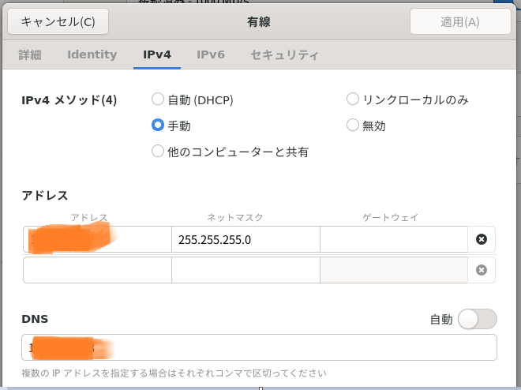

##### 自動スリープ解除

```
#スリープ機能を無効
sudo systemctl mask sleep.target suspend.target hibernate.target hybrid-sleep.target
sudo systemctl unmask sleep.target suspend.target hibernate.target hybrid-sleep.target
```

##### ウィンドウ画面の最小化

shift+F4

##### ファイアウォール

```
sudo ufw status numbered
sudo systemctl status ufw
```

##### OS のシステム更新

```
sudo apt update
sudo apt upgrade
```

##### pythonのバージョン確認

```
python3 --version
```

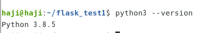

##### pipの導入

Ubuntuにはデフォルトでpipがインストールされていません

OS のシステム更新した後下記のコマンドを打つ

```
sudo apt install python3-pip
pip3 --version
which pip3
#pip3のアップデート
pip3 install -U pip
```

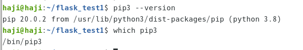

pipの代表的なコマンド

```
pip3 install package_name == 2.3
pip3 install -r requirements.txt
pip3 install –upgrade package_name
pip3 uninstall package_name
```

#### python設定

##### spyder導入

```
#こちらは失敗した
pip3 install spyder
sudo apt install spyder == 5.1.1
#こちらで再度チャレンジ
sudo apt install spyder3
sudo apt remove spyder#アンインストール
sudo apt --purge remove spyder#依存関係があるパッケージも含め、アンインストールする場合
spyder
```

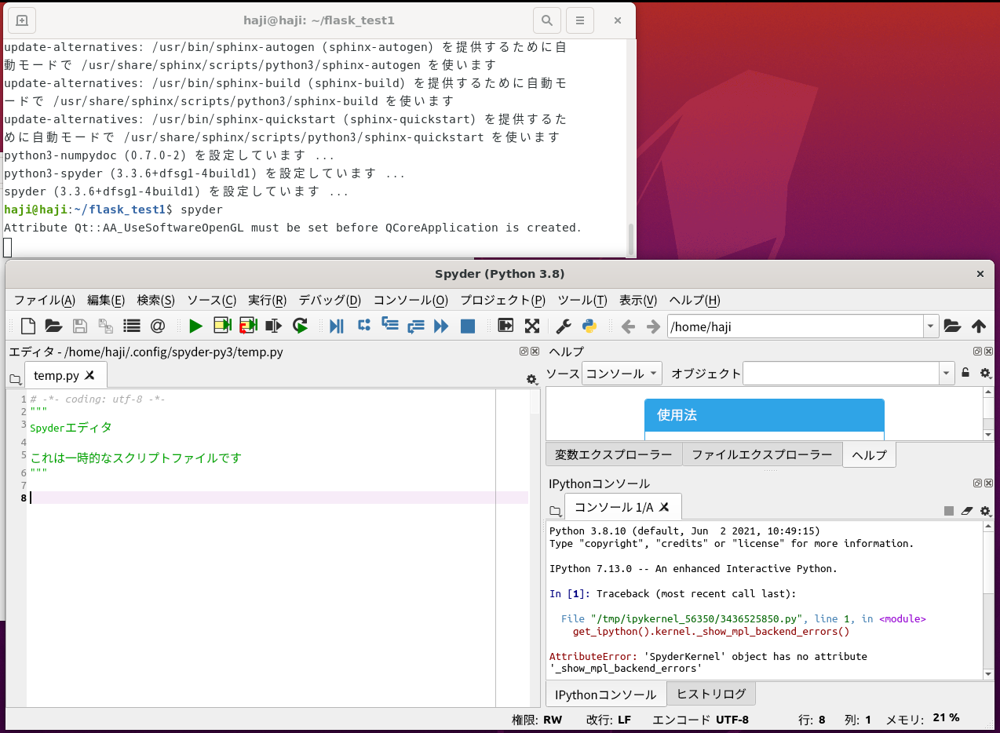

なぜかデバックができない？

### vscode導入

##### ダウンロードとインストール

https://code.visualstudio.com/

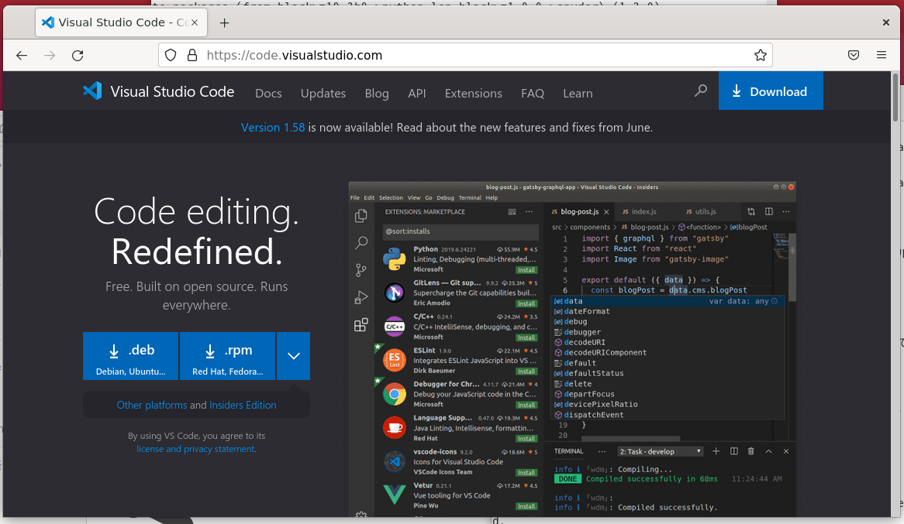


```
#ダインロードしたディレクトリで下記を打つ
#私がダウンロードしたものはcode_1.58.2-1626302803_amd64.debだった
sudo apt install ./code_1.58.2-1626302803_amd64.deb
```

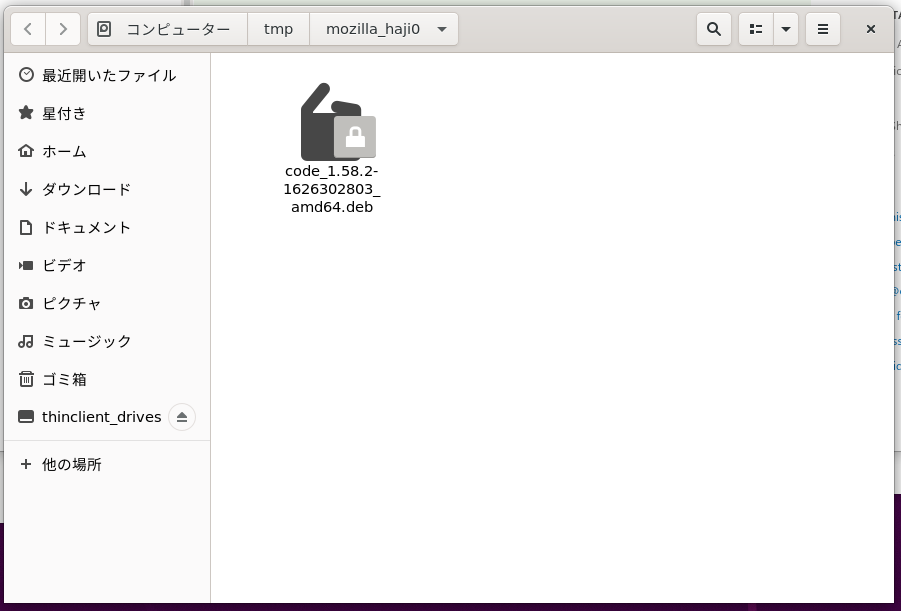

```
#起動
code
```

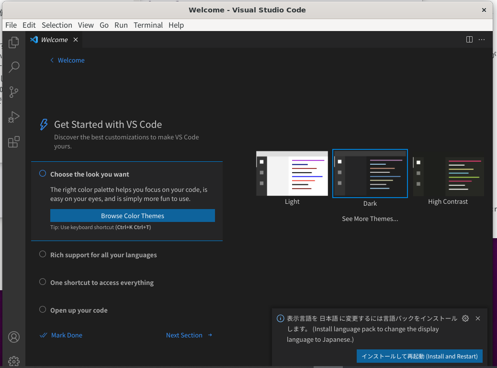

##### python環境

作者が「**MicroSoft**」の「Python」を選択します


##### pandasインストール

```
pip3 install pandas
```

pandas_test.pyを作成

```
import pandas as pd

d = {
    'a': [1, 2, 3],
    'b': [5, 6, 7],
}
data_b = pd.DataFrame(d)
```

実行してみた

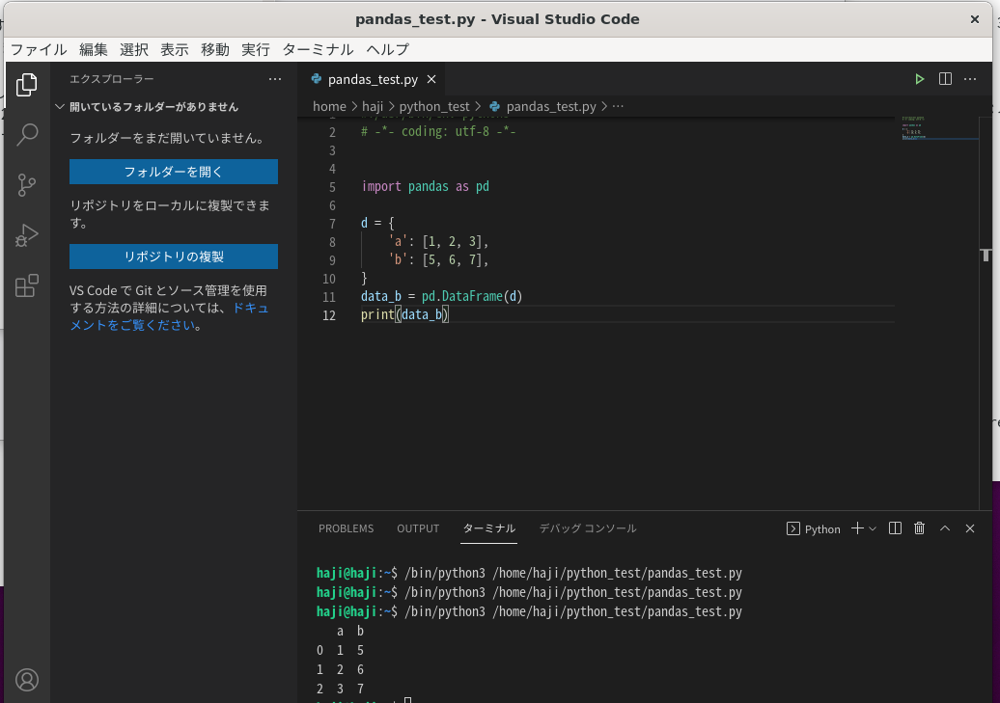

デバック実行もしてみる　まずはブレークポイントをつける（赤字のポイント）

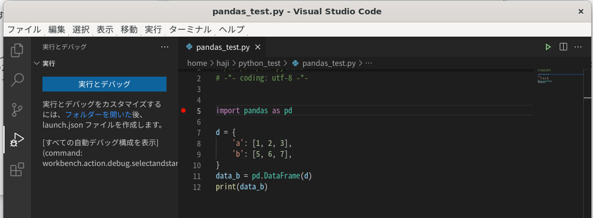

実行→デバッグの開始→python Fileの順にクリック

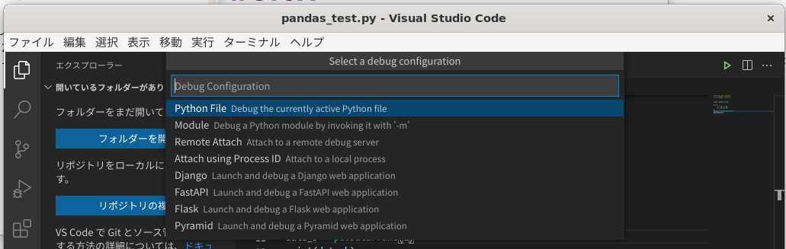

ステップインで一行ずつ実行できる

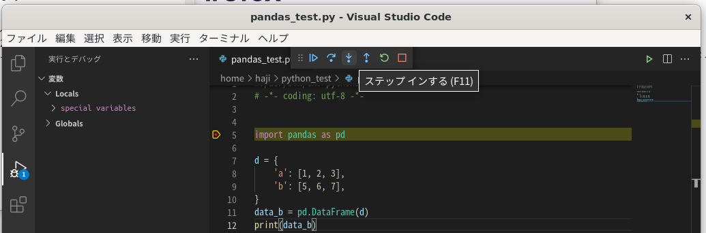

コードの1行目に **#%%** をつけてみた

jupyternotebookのような実行が可能になった

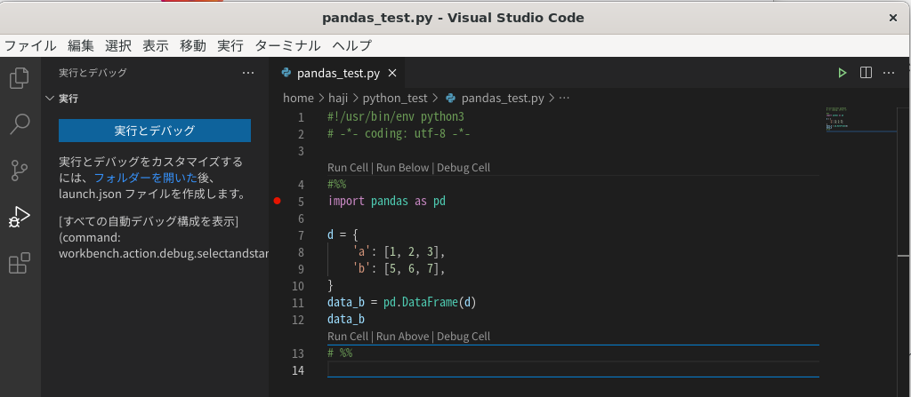

run cellを押す

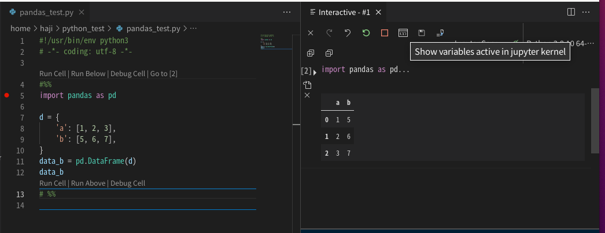

show variables active in jupyter kernelをクリック

中身を見たい変数をクリックすると中身が表示される

##### 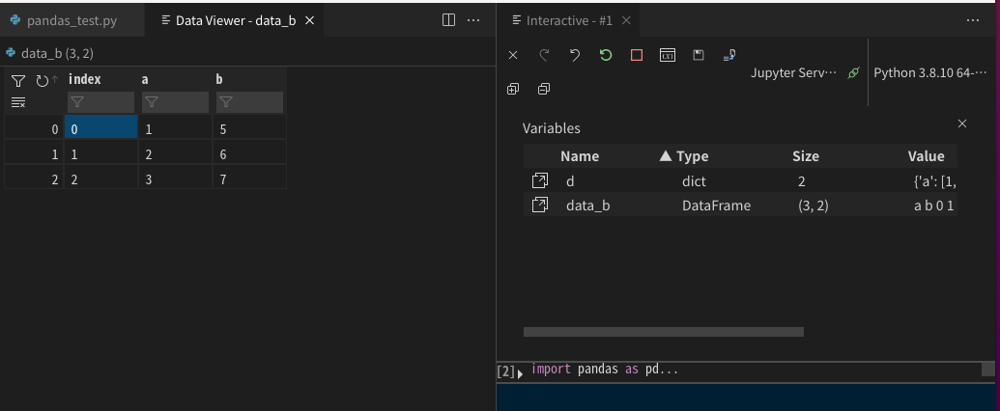

#### windowsにもインストール

想像以上にvscodeが使いやすくなっていたのでwindowsパソコンにもインストールしてみる

##### VSCode のアンインストール

「プログラムの追加と削除」から[VSCode] と検索しアンインストール

##### ユーザー設定の削除

[C:\Users\[ユーザー]\AppData\Roaming\Code] をフォルダ毎削除する。

##### 拡張機能の削除

「C:\Users\[ユーザー]\.vscode」をフォルダ毎削除する。

##### VSCode のダウンロード

https://code.visualstudio.com/

##### VSCode のインストール

すべてデフォルトでインストールした。

日本語設定まで済ます

##### python環境設定

作者が「**MicroSoft**」の「Python」を選択します


pandas_test.pyを作成

```
import pandas as pd

d = {
    'a': [1, 2, 3],
    'b': [5, 6, 7],
}
data_b = pd.DataFrame(d)
```

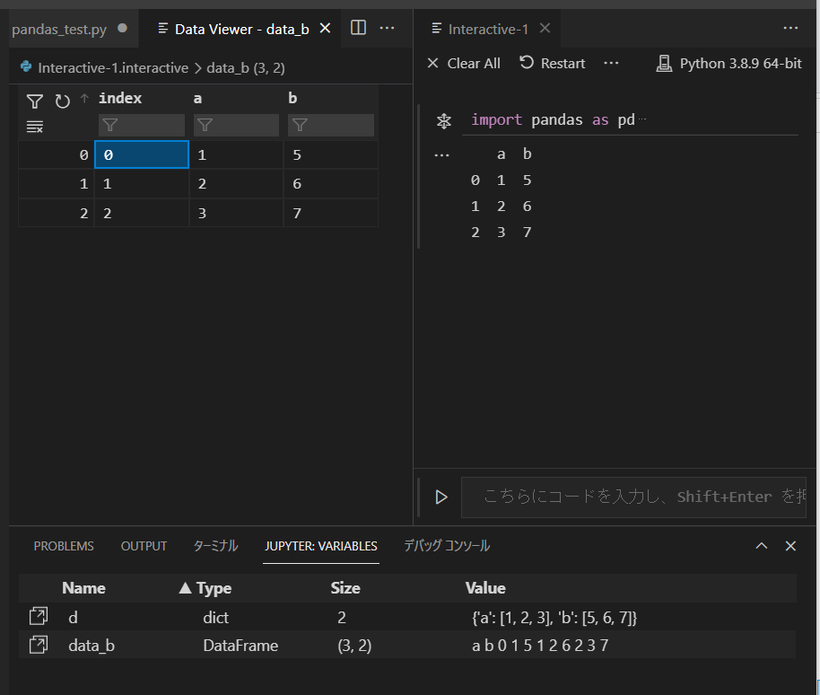

無事に実行でき変数の値も確認できるようになった。

### PLCの中身をpythonプログラムで取り出す

##### plcの情報

ip番号　172.21.5.100

D9000に-40000という値が入っている

ポート　8888を開放

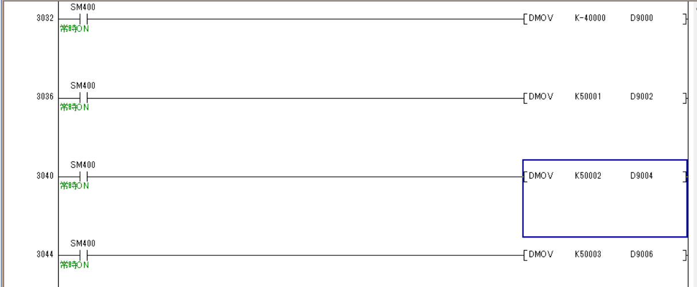

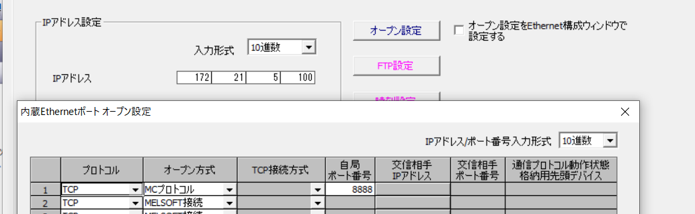

##### PLCとの通信確認

なぜかlanの２個目の設定がうまくいかない

cd /etc/netplan

sudo nano /etc/netplan/99_config.yaml

```
network:
  version: 2
  ethernets:
    eth0:
      dhcp4: false
      dhcp6: false
      addresses: [172.21.5.171/24]
      gateway4: 172.21.5.253
      nameservers:
        addresses: [ 8.8.8.8, 8.8.4.4]
    eth1:
      dhcp4: false
      dhcp6: false
      addresses: [172.21.5.90/24]
      gateway4: 172.21.5.253
      nameservers:
        addresses: [ 8.8.8.8, 8.8.4.4]
```

エラー確認

```
sudo netplan --debug try
sudo netplan --debug generate
```

ダメだった

```
network:
  version: 2
  ethernets:
    eno1:
      dhcp4: false
      dhcp6: false
      addresses: [172.21.5.171/24]
      gateway4: 172.21.5.253
    eno2:
      dhcp4: false
      dhcp6: false
      addresses: [172.21.5.90/24]
      gateway4: 172.21.5.253
```

適用

```
sudo netplan --debug apply
```

なぜか設定できた

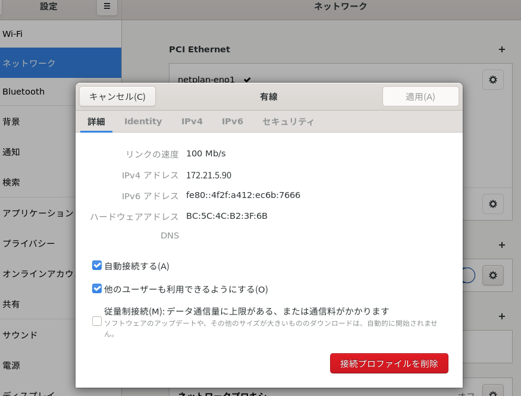

経路テーブルを確認

```
route -n 
```

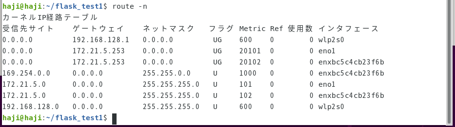


```
sudo ip rule add from 172.21.5.90 table 100 prio 200
sudo ip route add dev enxbc5c4cb23f6b src 172.21.5.90 table 100
```


```
ping 172.21.5.100 -I 172.21.5.90
```


色々してみたがらちが明かなかったので

PCは172.21.4.160　ゲートウェイ172.21.4.253

eno1 172.21.4.171　ゲートウェイ172.21.4.253

enxbc5c4cb23f6b  172.21.5.90　ゲートウェイ172.21.5.253

plc 172.21.5.100

という構成でpingで通信確認ができた

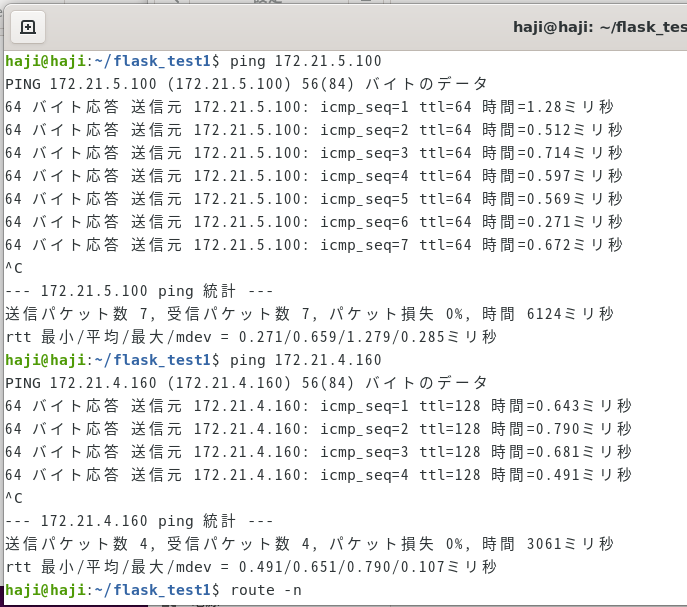

##### pythonプログラム

plc_test.py

```python
import socket

plc_send1=str("500000FFFF03000C00100001040000282300A82C01")#D9000から1個データ収集　ダブル
byte_data1=bytes.fromhex(plc_send3)

host = "172.21.5.100" #お使いのサーバーのホスト名を入れます
port = 8888 #適当なPORTを指定してあげます

def s32(value):return -(value & 0b10000000000000000000000000000000) | \
(value & 0b01111111111111111111111111111111)#0,1の数重要31個
def s16(value):return -(value & 0b1000000000000000) | (value & 0b0111111111111111)

client = socket.socket(socket.AF_INET, socket.SOCK_STREAM) #オブジェクトの作成をします
client.connect((host, port)) #これでサーバーに接続します
plc_ret1_0=client.send(byte_data1) #適当なデータを送信します（届く側にわかるように）
plc_ret1_0=client.recv(4096) #レシーブは適当な2の累乗にします（大きすぎるとダメ）
plc_ret1=plc_ret1_0.hex()
client.close()

def func1(x,y):       
    h=22+x*4
    plc16_val1=y[h+2]+y[h+3]+y[h]+y[h+1]
    plc16_val2=y[h+6]+y[h+7]+y[h+4]+y[h+5]
    plc32_val=plc16_val2+plc16_val1
    b=int(plc32_val,16) #16進数文字列を数値に変換
    plc10_num1=s32(b) #10進数符号付きに変換
    return plc10_num1

def func2(x,y):       
    h=22+x*4
    plc16_val1=y[h+2]+y[h+3]+y[h]+y[h+1]
    b=int(plc16_val1,16) #16進数文字列を数値に変換
    plc10_num1=s16(b) #10進数符号付きに変換
    return plc10_num1

v1=func1(0,plc_ret1)
```

実行して確認してみた

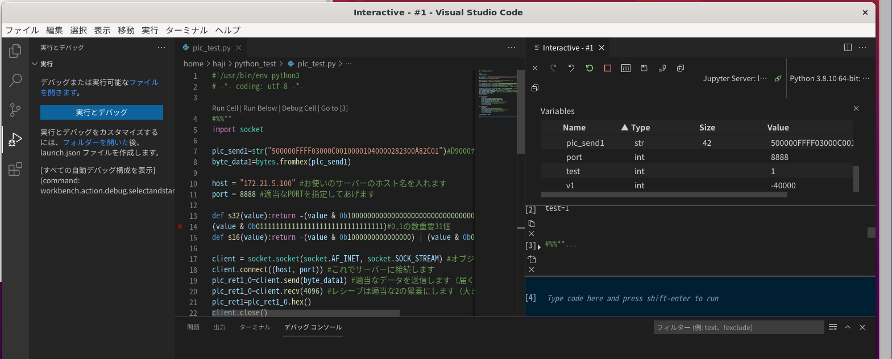

v1に-40000が取得できた

※以下参考

読み込みの場合

```python
plc_send1=str("500000FFFF03000C00100001040000282300A82C01")D9000から1個データを取得
plc_send1=str("500000FFFF03000C00100001040000307500A82C01")D30000から300個データを取得
バイナリコード交信
5000　サブヘッダ　
00　ネットワーク番号
FF PC番号
FF03 要求先ユニットIO番号
00　要求先ユニット局番号
0C00 要求データ長（読みは基本これでOK）これ以降が24文字（バイナリなので12文字）
1000　CPU監視タイマ
0104　一括読み出し
0000　サブコマンド
3075　要求データ部（30000→2328　16進数）（9000→2328　16進数）
00A8　要求データ部（D※）
2C01　要求データ部（300→012C）
```

書き込みの場合

```python
plc_send3=str("500000FFFF03000E00100001140000187900A801000100")#D31000から1個データを1にする
バイナリコード交信
5000　サブヘッダ　
00　ネットワーク番号
FF PC番号
FF03 要求先ユニットIO番号
00　要求先ユニット局番号
0C00 要求データ長（読みは基本これでOK）これ以降が24文字（バイナリなので12文字）
1000　CPU監視タイマ
0114　一括書き込み
0000　サブコマンド
1879　要求データ部（31000→7918　16進数）
00A8　要求データ部（D※）
0100　要求データ部（1→0001）
0100　要求データ部（1→0001）
```

